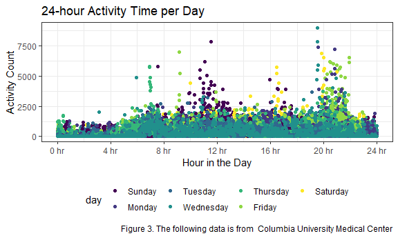

p8105\_hw3\_ew2717
================
Eric Wang

## Problem 1

*Loading instacart data*

``` r
data("instacart")

instacart_df <-
  instacart %>% 
  janitor::clean_names()
```

#### Instacart data exploration

*Finding rows, columns, and key variables*

``` r
instacart_rows = instacart_df %>% 
  nrow()
instacart_cols = instacart_df %>% 
  ncol()
instacart_names = instacart_df %>% 
  names()
```

The number of rows in the instacart data set is **1384617**. The number
of columns in the instacart data set is **15**. The key variables in the
instacart data set are **order\_id, product\_id, add\_to\_cart\_order,
reordered, user\_id, eval\_set, order\_number, order\_dow,
order\_hour\_of\_day, days\_since\_prior\_order, product\_name,
aisle\_id, department\_id, aisle, department**.

*Finding how many aisles there are and which aisles are the most items
ordered from*

``` r
instacart_aisles <- 
  instacart_df %>% 
  group_by(aisle) %>% 
  summarize(n_obs = n()) %>% 
  arrange(desc(n_obs))

instacart_aisles
```

    ## # A tibble: 134 x 2
    ##    aisle                          n_obs
    ##    <chr>                          <int>
    ##  1 fresh vegetables              150609
    ##  2 fresh fruits                  150473
    ##  3 packaged vegetables fruits     78493
    ##  4 yogurt                         55240
    ##  5 packaged cheese                41699
    ##  6 water seltzer sparkling water  36617
    ##  7 milk                           32644
    ##  8 chips pretzels                 31269
    ##  9 soy lactosefree                26240
    ## 10 bread                          23635
    ## # ... with 124 more rows

As seen above, there are 134 aisles, and the aisles that have the most
items ordered from are the “fresh vegetables”, “fresh fruits”, “packaged
vegetable fruits”, “yogurt”, and “packaged cheese”.

*Creating a table showing the three most popular items in each of the
aisles “baking ingredients”, “dog food care”, and “packaged vegetables
fruits”, including the number of times each item is ordered*

``` r
aisle_table <- 
  instacart_df %>% 
  group_by(aisle) %>% 
  summarize(item_count = n()) %>% 
  filter(item_count > 10000) %>% 
  ggplot(aes(x = reorder(aisle, item_count), 
             y = item_count)) +
  geom_bar(stat = "identity") +
  labs(
    title = "Items ordered per Aisle",
    x = "Aisle",
    y = "# of Items",
    caption = "Figure 1. The table depicts the number of items ordered per aisle (>10000 items)."
  ) +
  coord_flip() +
  theme(axis.text.y = element_text(size = 6))

aisle_table
```


*Making a table showing the three most popular items in each of the
aisles “baking ingredients”, “dog food care”, and “packaged vegetables
fruits”, including the number of times each item is ordered*

``` r
popular_table <- 
  instacart_df %>% 
  filter(aisle %in% c("baking ingredients", "dog food care", "packaged vegetables fruits")) %>% 
  group_by(aisle, product_name) %>% 
  summarize(item_count = n()) %>% 
  filter(min_rank(desc(item_count)) < 4) %>% 
  arrange(desc(item_count)) 
  
knitr::kable(popular_table)
```

| aisle                      | product\_name                                 | item\_count |
|:---------------------------|:----------------------------------------------|------------:|
| packaged vegetables fruits | Organic Baby Spinach                          |        9784 |
| packaged vegetables fruits | Organic Raspberries                           |        5546 |
| packaged vegetables fruits | Organic Blueberries                           |        4966 |
| baking ingredients         | Light Brown Sugar                             |         499 |
| baking ingredients         | Pure Baking Soda                              |         387 |
| baking ingredients         | Cane Sugar                                    |         336 |
| dog food care              | Snack Sticks Chicken & Rice Recipe Dog Treats |          30 |
| dog food care              | Organix Chicken & Brown Rice Recipe           |          28 |
| dog food care              | Small Dog Biscuits                            |          26 |

## PROBLEM 2

*Loading BRFSS dataset*

``` r
data("brfss_smart2010")
```

*Cleaning brfss data set*

``` r
brfss_df <- 
  brfss_smart2010 %>% 
  janitor::clean_names() %>% 
  filter(
  topic == "Overall Health",
  response %in% c("Poor", "Fair", "Good", "Very good", "Excellent")) %>% 
  mutate(response = as.factor(response), response = ordered(response, levels = c("Poor", "Fair", "Good", "Very good", "Excellent"))) %>% 
  select(year, locationdesc, topic, response, data_value, sample_size) %>%
  separate(locationdesc, into = c("State", "County"), sep = " - ")
```

*Finding which states were observed at 7 or more locations in 2002 and
2010*

``` r
brfss_df_02 <- 
  brfss_df %>% 
  group_by(State) %>% 
  filter(year == "2002") %>%
  distinct(County) %>%
  count(State) %>% 
  filter(n >= 7) %>% 
  arrange(n)

brfss_df_10 <- 
  brfss_df %>% 
  group_by(State) %>% 
  filter(year == "2010") %>%
  distinct(County) %>%
  count(State) %>% 
  filter(n >= 7) %>% 
  arrange(n)

knitr::kable(brfss_df_02)
```

| State |   n |
|:------|----:|
| CT    |   7 |
| FL    |   7 |
| NC    |   7 |
| MA    |   8 |
| NJ    |   8 |
| PA    |  10 |

``` r
knitr::kable(brfss_df_10)
```

| State |   n |
|:------|----:|
| CO    |   7 |
| PA    |   7 |
| SC    |   7 |
| OH    |   8 |
| MA    |   9 |
| NY    |   9 |
| NE    |  10 |
| WA    |  10 |
| CA    |  12 |
| MD    |  12 |
| NC    |  12 |
| TX    |  16 |
| NJ    |  19 |
| FL    |  41 |

As the tables depict, CT, FL, NC, MA, NJ, and PA were observed at 7 or
more locations in 2002, and CA, CO, FL, MA, MD, NC, NE, NJ, NY, OH, PA,
SC, TX, and WA were observed at 7 or more locations in 2010.

*Constructing a dataset that is limited to Excellent responses, and
contains, year, state, and a variable that averages the data\_value
across locations within a state*

``` r
brfss_excellent_df <-
  brfss_df %>%
  filter(response == "Excellent") %>% 
  group_by(State, year) %>% 
  mutate(avg_data_value = mean(data_value, na.rm = TRUE),
         avg_data_value = round(avg_data_value, digits = 4)) %>%
  select(year, State, avg_data_value) 
```

*Making a spaghetti plot of this average value over time within a state*

``` r
brfss_df %>% 
  filter(response == "Excellent") %>% 
  group_by(year, State) %>%
  summarize(mean_value = mean(data_value), na.rm = TRUE) %>% 
  ggplot(aes(x = year, 
             y = mean_value, 
             group = State, 
             color = State)) +
  geom_line() +
  labs(
    title = "Average Value over Time per State",
    x = "Year",
    y = "Average Value") +
  theme(legend.position = "right")
```


This spaghetti plot shows that the average data\_value across locations
within states seem to cary greatly every single year, from 2002 to 2010.

*Making a two-panel plot showing the distribution of data\_value for
responses among locations in NY State for the years 2006 and 2010*

``` r
brfss_df %>%
  filter(year == "2006" | year == "2010",
         State == "NY") %>% 
  ggplot(aes(x = response, y = data_value, color = response)) +
  geom_boxplot() +
  facet_grid(. ~ year) +
labs(
    title = "NY Distribution of data values for 2006 and 2010, by Responses",
    x = "Response",
    y = "Data Value"
  )
```


## Problem 3

*Loading accelerometer data set*

``` r
accel_df <- 
  read_csv("./data/accel_data.csv") %>%
  janitor::clean_names() 
```

    ## Rows: 35 Columns: 1443

    ## -- Column specification --------------------------------------------------------
    ## Delimiter: ","
    ## chr    (1): day
    ## dbl (1442): week, day_id, activity.1, activity.2, activity.3, activity.4, ac...

    ## 
    ## i Use `spec()` to retrieve the full column specification for this data.
    ## i Specify the column types or set `show_col_types = FALSE` to quiet this message.

*Tidying data set*

``` r
accel_tidy <-
  accel_df %>%
  pivot_longer(
    activity_1:activity_1440,
    names_to = "minute",
    names_prefix = "activity_",
    values_to = "activity_count") %>%
  mutate(
    week = as.integer(week), 
    day_id = as.integer(day_id), 
    minute = as.integer(minute),
    hour = as.integer(minute %/% 60), 
    day = factor(day, levels = c("Sunday","Monday", "Tuesday", "Wednesday", "Thursday", "Friday", "Saturday")),
    weekday_vs_weekend = 
      case_when(
           day %in% c("Monday", "Tuesday", "Wednesday", "Thursday", "Friday") ~ "Weekday", 
           day %in% c("Saturday", "Sunday") ~ "Weekend")) 
```

*Analyzing accelerometer data*

``` r
accel_var = accel_tidy %>% 
  names()
accel_dim = accel_tidy %>% 
  dim()
accel_rows = accel_tidy %>% 
  nrow()
accel_cols = accel_tidy %>% 
  ncol()
```

This data set was tidied, and we found that its key variables are
**week, day\_id, day, minute, activity\_count, hour,
weekday\_vs\_weekend**. Additionally, the dimensions are **50400, 7**,
the number of columns are **7**, and the number of rows are **50400**.

*Creating a table that shows total activity count for each day of the
week*

``` r
accel_tidy %>%
  group_by(day) %>%
  summarize(total_activity = sum(activity_count, na.rm = TRUE)) %>%
  knitr::kable(caption = 
      "Figure 2. Total Activity Count per Day"
  )
```

| day       | total\_activity |
|:----------|----------------:|
| Sunday    |         1919213 |
| Monday    |         1858699 |
| Tuesday   |         1799238 |
| Wednesday |         2129772 |
| Thursday  |         2091151 |
| Friday    |         2291711 |
| Saturday  |         1369237 |

Figure 2. Total Activity Count per Day

One apparent trend seen from the table is that activity count is
noticeably higher towards the end of the week, from Wednesday to Friday.
Additionally, Saturday can be assumed to be a rest day, as it is
significantly lower in total activity compared to the rest of the days.

*Making a single-panel plot that depicts 24-hour activity time courses
for every day*

``` r
accel_tidy %>%
  group_by(day, minute) %>%
  ggplot(aes(x = minute, 
             y = activity_count, 
             color = day)) +
  geom_point() +
  labs(
    title = "24-Hour Activity Time per Day",
    x = "Hour in the Day",
    y = "Activity Count",
    caption = "Figure 3. The following data is from  Columbia University Medical Center") + 
  scale_x_continuous(
    breaks = c(0, 240, 480, 720, 960, 1200, 1440),
    labels = c("0 hr", "4 hr", "8 hr", "12 hr", "16 hr", "20 hr", "24 hr"))
```



This accelerometer data set is tidied. It shows five weeks of data for
one person.

Based on this plot, we can see that activity count is higher later on
throughout the day during weekdays. On the weekends, however, we can see
that activity count is actually higher throughout the middle of the day.
